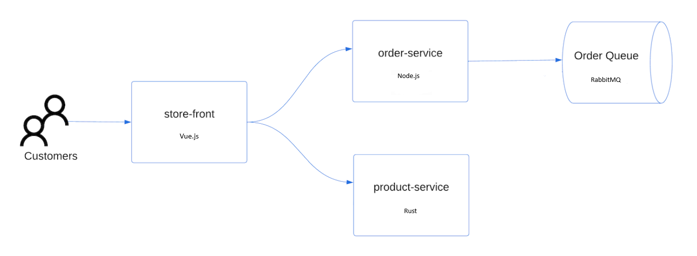

# aks-terraform-quickstart

This repository provides a quickstart guide for deploying an Azure Kubernetes Service (AKS) cluster using Terraform. Follow this guide to set up the necessary tools and infrastructure.

---

## Prerequisites

Before you begin, ensure you have the following tools installed and configured:

### 1. Install **Azure CLI**
Azure CLI is required to authenticate with your Azure subscription.

- [Azure CLI Installation Guide](https://learn.microsoft.com/en-us/cli/azure/install-azure-cli)
- After installation, log in to your Azure account:

```bash
# Connect and set Subscription Context in Azure
az login

# Verify current account login
az account show
```


### 🔍 Verify the Results of Your AKS Cluster Deployment

Follow these steps to ensure your AKS cluster is up and running correctly:

1. **Get the Resource Group Name**:
   - Run this command to retrieve the resource group name created by Terraform:
     ```bash
     resource_group_name=$(terraform output -raw resource_group_name)
     ```

2. **Display the Kubernetes Cluster Name**:
   - Use the Azure CLI to list the name of your AKS cluster:
     ```bash
     az aks list \
       --resource-group $resource_group_name \
       --query "[].{\"K8s cluster name\":name}" \
       --output table
     ```

3. **Generate Kubernetes Configuration**:
   - Save the Kubernetes configuration to a file:
     ```bash
     echo "$(terraform output -raw kube_config)" > ./azurek8s
     ```

4. **Check for ASCII Characters**:
   - Ensure the file doesn’t contain unnecessary ASCII characters:
     ```bash
     cat ./azurek8s
     ```
   - ⚠️ **If you see** `<< EOT` **or** `EOT` **characters, remove them manually**. Otherwise, you might encounter YAML parsing errors.

5. **Set the Configuration File for kubectl**:
   - Point `kubectl` to the generated configuration file:
     ```bash
     export KUBECONFIG=./azurek8s
     ```

6. **Verify Cluster Health**:
   - Check the status of your nodes:
     ```bash
     kubectl get nodes
     ```
   - ✅ When you created the cluster, monitoring was enabled. Health metrics for nodes and pods are available in the Azure portal.

7. **Key Outputs**:
   - Terraform outputs critical details like:
     - Host address
     - AKS cluster username
     - AKS cluster password

🎉 **Your AKS cluster is now ready to manage workloads!** For more details on monitoring, see [Monitor Azure Kubernetes Service health](https://learn.microsoft.com/azure/aks/monitor-health).

# 🚀 Deploying the AKS Store Application

### 📋 **Overview**
To deploy the Azure Kubernetes Service (AKS) Store app, you use a **manifest file - folder app** to define the application's desired state. This includes container images, deployments, and services.



### 🛠️ **Components**
The deployment includes the following services:
- **Store front**: 🌐 A web app for customers to browse products and place orders.
- **Product service**: 📦 Displays product details.
- **Order service**: 🛒 Processes orders.
- **Rabbit MQ**: 📨 Handles order message queues.

⚠️ *Note*: For production environments, avoid stateful containers like Rabbit MQ without persistent storage. Consider managed services like **Azure CosmosDB** or **Azure Service Bus**.

---

### 📂 **Steps to Deploy**
1. **Create Manifest File**:
   - Save the configuration in `app/aks-store-quickstart.yaml`.
   - This file includes definitions for `Deployments` and `Services`.

2. **Deploy with kubectl**:
Run:
```bash
kubectl apply -f aks-store-quickstart.yaml
```

Check Pod Status: Ensure all pods are running:

```bash
kubectl get pods

#Monitor External IP: Watch for the public IP of the store-front service:

kubectl get service store-front --watch

NAME          TYPE           CLUSTER-IP    EXTERNAL-IP    PORT(S)        AGE
store-front   LoadBalancer   10.0.100.10   20.62.159.19   80:30025/TCP   4h5m
```

#### 🌐 Access the App
Once the EXTERNAL-IP is assigned, open it in a web browser to access the app.
🎉 Your AKS Store application is now live! Happy deploying! 🚀


#### 🗑️ Clean Up Resources: Delete AKS Resources

When you're done with the AKS deployment, you can clean up the resources created by Terraform to avoid unnecessary costs.

### 🛠️ **Steps to Destroy Resources**
1. **Generate a Destroy Plan**:
   Run the following command to create a plan for deleting resources:
   ```bash
   terraform plan -destroy -out main.destroy.tfplan